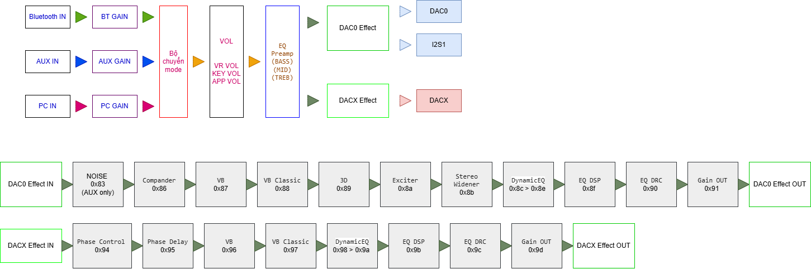

## 📦 ANT – FW & Tools

---

### 🛠 Công cụ liên quan

| Tool | Mô tả | Link |
|------|------|------|
| **ACPWorkbench** | DSP gốc của MVsilicon | 👉 [Tải xuống](https://github.com/nvmaudio/ACPWorkbench) |
| **MV_Assisant_Tools** | Tool update FW (MVsilicon) | 👉 [Tải xuống](https://github.com/nvmaudio/MV_Assisant_Tools) |
| **NVM-TOOL-PC** | DSP & cấu hình thông số (PC) | 👉 [Tải xuống](https://github.com/nvmaudio/NVM-TOOL-PC) |
| **NVM-TOOL-MOBILE** | DSP & cấu hình thông số (Mobile) | 👉 [Tải xuống](https://github.com/nvmaudio/NVM-TOOL-MOBILE) |

---

### ⚠️ Lưu ý
- Sau khi **Update FW** hoặc **Thiết lập hệ thống lần đầu** :
  - Cần cấu hình hệ thống bằng: `NVM-TOOL-PC` hoặc `NVM-TOOL-MOBILE`
  - Mục **Cài Đặt Nhanh** [*]:
    - Class: `2.0 / 2.1 / MONO / 1.1 / 3way`
    - Phím bấm: `Bật / Tắt`
    - Biến trở: `Bật / Tắt`
    - EQ / Preamp: `Bật / Tắt` + Preamp mode
---

### 📥 Firmware
- 🔗 [Download FW ANT mới nhất V4.0.9](https://github.com/nvmaudio/ANT/releases/download/ANT/ANTv4.0.9.mva)
- 🔗 [Download FW ANT Các bản cũ hơn](http://github.com/nvmaudio/ANT/releases/tag/ANT)

---

### 🔇 MUTE Control
- `High` → Có nhạc  
- `Low` → Tắt nhạc
- Lưu ý: Chú ý khi ghép mạch CS, tránh **xông điện ngược** về Chip > **5V**
---

### 🎛 KEY Control

|      | Key 1 | Key 2 | Key 3 | Key 4 | Key 5 |
|:-----|:------|:------|:------|:------|:------|
| Giá trị | 100Ω | 4.7KΩ | 8.2KΩ | 100KΩ | 220KΩ |

---

### 💻 Hệ Thống DSP

---

### 💻 Cài Đặt Biến trở + Preamp
- Biến trở dùng để điều chỉnh Âm lượng tổng hay Độ lớn âm lượng `Bass Mid Treb` Khi **Preamp** Bật
  - **Âm lượng tổng**: Âm lượng toàn hệ thống 
  - **Preamp**: Chức năng điều chỉnh `Bass Mid Treb` bằng  **Music Preamp EQ**:
    - Bass: **F0** , Chỉnh Hz và Q theo sở thích mặc định **60**Hz Q**0.5**
    - Mid: **F1** , Chỉnh Hz và Q theo sở thích mặc định **1.000**Hz Q**0.5**
    - Treb: **F2**, Chỉnh Hz và Q theo sở thích mặc định **10.000**Hz Q**0.5**
  - Để thay đổi độ lớn +- của Pregain, dùng biến trở hay điều khiển qua App mobile. Hãy vào Cài đặt > Pregain điều chỉnh.
  - Có thể Tắt **Biến trở** và Bật **Pream**p  để chỉnh `Bass Mid Treb` bằng **APP** mà không cần thiết kế **Biến trở** cho Loa
---

### 💻 File DSP mặc định

[Download File cho ACPWorkbench](https://github.com/nvmaudio/ANT/blob/main/macdinh.ini)

[Download File cho NVM-TOOL-PC](https://github.com/nvmaudio/ANT/blob/main/effects_backup.json)

---
